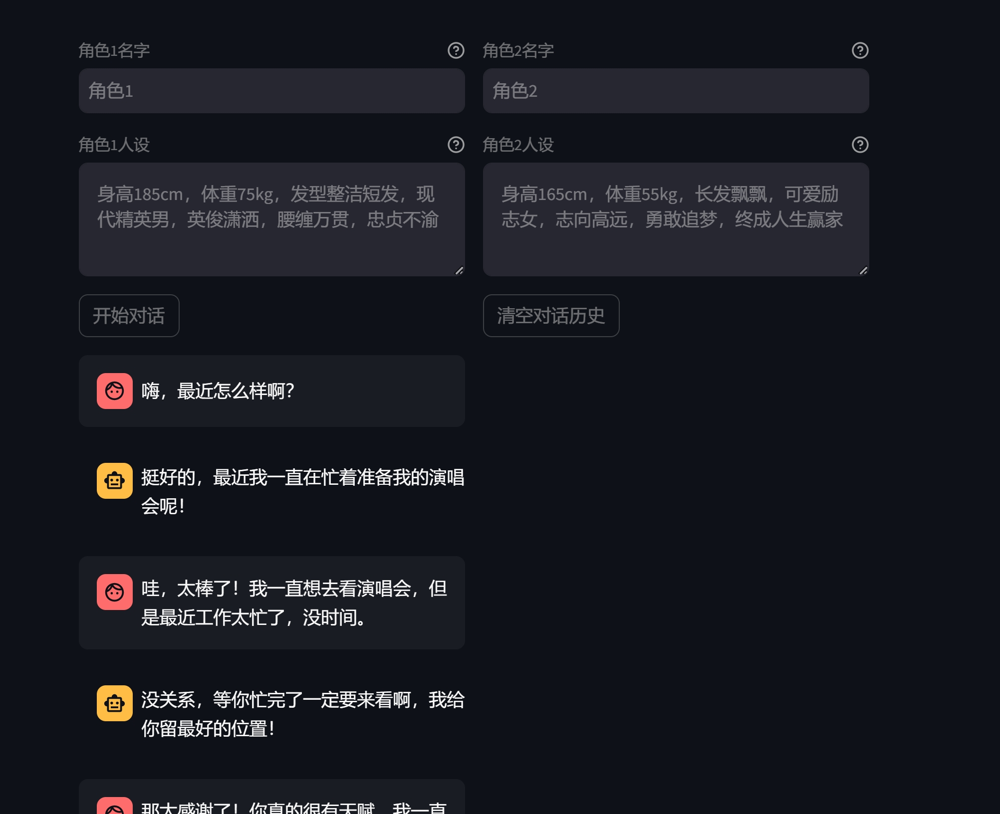

# CharacterGLM-role-play
实现 role-play 对话数据生成工具：

1. 基于一段文本（自己找一段文本，复制到提示词就可以了，比如你可以从小说中选取一部分文本，注意文本要用 markdown 格式）生成角色人设，可借助 ChatGLM 实现。
2. 给定两个角色的人设，调用 CharacterGLM 交替生成他们的回复。
3. 将生成的对话数据保存到文件中(chat.txt)。
4. 通过点击图形界面上的按钮执行对话数据生成，并展示对话数据。

# 部署
1. 代码上传服务器
2. 创建python虚拟环境
3. pip install -r requirements.txt
4. streamlit run --server.address 127.0.0.1 main.py 
服务启动后通过浏览器访问

代码进行了不设置，最多在6次以内的对话生成，可以修改for循环次数  

点击 “开始对话”按钮，便会根据设定的两个角色自动进行对话，效果如下：
